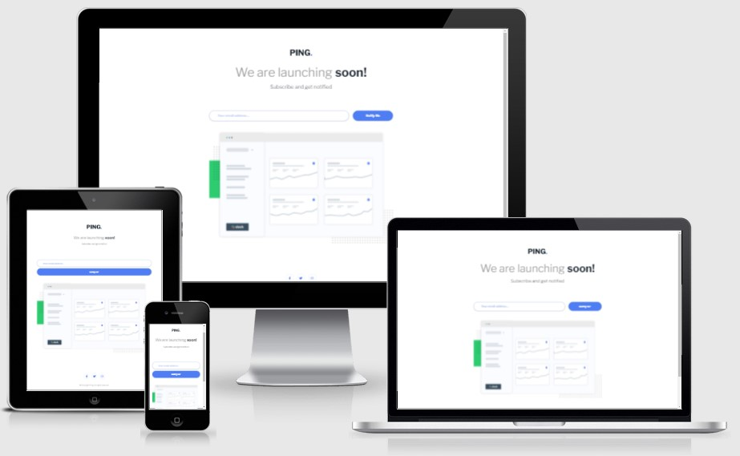

# Frontend Mentor - Ping coming soon page solution

## 👋 Introduction

Hello, welcome and thank you for checking out this ReadMe.

This is a solution to the [Ping coming soon page challenge on Frontend Mentor](https://www.frontendmentor.io/challenges/ping-single-column-coming-soon-page-5cadd051fec04111f7b848da).
Frontend Mentor challenges help you improve your coding skills by building realistic projects.

If you have any questions or if you can give me some advice to help me become a better developer, please feel free to send me a message. [My contact information is down below.](#-author)

## 📑 Table of contents

- [Overview](#-overview)
- [The challenge](#the-challenge)
- [Screenshot](#screenshot)
- [Links](#links)
- [My process](#-my-process)
- [Built with](#built-with)
- [What I learned](#what-i-learned)
- [Continued development](#continued-development)
- [Useful resources](#useful-resources)
- [Author](#-author)
- [Acknowledgments](#-acknowledgments)

**Note: Delete this note and update the table of contents based on what sections you keep.**

## 📋 Overview

### The challenge

Users should be able to:

- View the optimal layout for the site depending on their device's screen size
- See hover states for all interactive elements on the page
- Submit their email address using an `input` field
- Receive an error message when the `form` is submitted if:
  - The `input` field is empty. The message for this error should say _"Whoops! It looks like you forgot to add your email"_
  - The email address is not formatted correctly (i.e. a correct email address should have this structure: `name@host.tld`). The message for this error should say _"Please provide a valid email address"_

### Screenshot



### Links

- Solution URL: [https://www.frontendmentor.io/challenges/ping-single-column-coming-soon-page-5cadd051fec04111f7b848da/hub/ping-single-column-coming-soon-page-jaYlDiATx](https://www.frontendmentor.io/challenges/ping-single-column-coming-soon-page-5cadd051fec04111f7b848da/hub/ping-single-column-coming-soon-page-jaYlDiATx)
- Live Site URL: [https://lumensum.github.io/FEM-ping-single-column-coming-soon-page/](https://lumensum.github.io/FEM-ping-single-column-coming-soon-page/)

## 🎓 My process

### Personal Learning Goals

The goal for me with this project was learning about responsiveness and accessibility. In the previous projects I used a lot of fixed dimensions to make it look like toe design as much as possible. For this one I tried using none, but I still had to use it a couple of times. However, I tried to reduce that as much as possible.

I also made the mobile-version first.

I tried to make the files as clean as possible. Instead of BEM naming and a lot of divs's, I used pure selectors when availlable.

### Built with

- Semantic HTML5 markup
- Flexbox
- Mobile-first workflow

### What I learned

Use this section to recap over some of your major learnings while working through this project. Writing these out and providing code samples of areas you want to highlight is a great way to reinforce your own knowledge.

To see how you can add code snippets, see below:

```html
<h1>Some HTML code I'm proud of</h1>
```

```css
.proud-of-this-css {
  color: papayawhip;
}
```

```js
const proudOfThisFunc = () => {
  console.log("🎉");
};
```

If you want more help with writing markdown, we'd recommend checking out [The Markdown Guide](https://www.markdownguide.org/) to learn more.

**Note: Delete this note and the content within this section and replace with your own learnings.**

### Continued development

Use this section to outline areas that you want to continue focusing on in future projects. These could be concepts you're still not completely comfortable with or techniques you found useful that you want to refine and perfect.

**Note: Delete this note and the content within this section and replace with your own plans for continued development.**

### Useful resources

- [Meta Tags](https://metatags.io/) - I used this very easy-to-use meta tag generator to help me with the meta tags for sharing the URL.

- [Example resource 2](https://www.example.com) - This is an amazing article which helped me finally understand XYZ. I'd recommend it to anyone still learning this concept.

**Note: Delete this note and replace the list above with resources that helped you during the challenge. These could come in handy for anyone viewing your solution or for yourself when you look back on this project in the future.**

## 📧 Author

- 💻️ Frontend Mentor - [@royschrauwen](https://www.frontendmentor.io/profile/royschrauwen)
- 🍗 Twitter - [@royschrauwen](https://www.twitter.com/royschrauwen)

## 🙏 Acknowledgments

I got a lot of tips, tricks, advice and help from the Frontend Mentor Community on Slack. I am really greatful for the awesome support.
